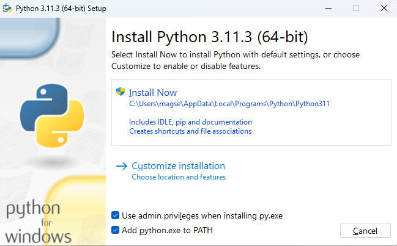

# shutter_lover_remote_app

The remote application of the Shutter Lover tool.  
The Shutter Lover is a device designed to measure the translation speed of the curtains of the focal plane shutters of film cameras.  This application is used to collect on a personal computer the data generated by the device.  
The goal is to measure the travel speed of the curtains, in order to adjust them to reach the constructor recommendations, as found on the following compilation:  
<https://github.com/srozum/film_camera_tester/wiki/Curtains-Travel-Times>

## Installation

This application is written in Python language and so can be executed on any platform that supports Python language.  

Here is the installation instructions for Windows platform. Steps are similar on other platforms.  

1. Install Python packages:  
   See <https://www.python.org/downloads/>  
   
   On the installer panel:  
     

   - **select the checkbox "Add python.exe to PATH"**
   - click on "Customize installation"  
   
   
   Then check that at least the following options are selected:  
   - pip  
   - tcl/tk and IDLE  
   - py launcher  
   - for all user  

     
   
   Then click on "Next" then "Install".  
   After installation, reboot your computer.  

   **Note for OSX users** : the installation of the python "pip" package is mandatory for the next step. On OSX, the installation of the "pip" package can be done following the above instructions :  
   https://www.groovypost.com/howto/install-pip-on-a-mac/ 

3. Install PySerial package:  
   - On Windows Search Tool, type "cmd" and click on the Command Prompt application.  
   - Into the command prompt, execute the following line :  

   ```text
   pip install pyserial
   ```

4. Download the file shutter_lover_remote_app.py :  
   Get the application from the following link:  
   <https://github.com/sebastienroy/shutter_lover_remote_app/releases/download/v1.1.0/shutter_lover_remote_app.py>  
  Save the file somewhere on your computer  

5. Right-click on the downloaded file and select "Open With", then select Python.  
   You can choose to always use Python to open files having ".py" extension, so that you can execute the application through a double-click on the file.

## Usage

- Connect the Shutter Lover tool on your computer using the provided USB cable
- Switch on the device
- Open the Shutter Lover Remote Application
- The application should automatically discover the communication port used by the tool and establish the communication.
- If not connected, use the combo box to choose the right communication port
- Choose de shutter curtain translation direction, using the dedicated combo box. This choice has an impact on the extrapolated course timing (see above) 
- Choose the current camera speed setting. 
- Perform your shutter measurements. 
  - Each time a measurement is made, a new line is added in the Remote Application, containing the full details of the measurement data.
  - The current value of the "Camera Speed setting" combo is reported in the second column of the new line
  - In order to change the speed setting of a given line, double click on its speed setting cell
- In order to save your data, click on "Copy to Clipboard" button, then paste the data (CTRL+V) on any external application such as spreadsheet application or text editor.
- To clean the data, click on the "Clear All" button.

## Data Description

| Column Name | Description |
| :--: |:-- |
| Id | The row number. Reset to 0 when clearing the table. |
| Setting (1/s) | In this column is reported the current value of the Camera Speed setting combo box. It is used as a reference to compare with the measured value. This value is editable by double-click on the cell. |
| Speed (1/s) | The shutter opening speed measured on the central sensor. This is the inverse of the open time. Unit : 1/s |
| Time (ms) | The shutter open time measured on the central sensor. Unit : ms |
| Open (ms) | The travel time of the first curtain (opening curtain) of the shutter, measured between the sensors located on the corners of the frame. Unit : ms |
| Close (ms) | The travel time of the second curtain (closing curtain) of the shutter, measured between the sensors located on the corners of the frame. Unit : ms |
| Open ext | The sensors of the Shutter Lover are located on the corners of a 20mm x 32mm rectangle. This value is the extrapolation of the first curtain travel time on the whole 24x36 film frame. The extrapolation calculation depends on the selected translation direction. Unit: ms |
| Close ext | Extrapolation of the second curtain travel time. Unit: ms |
| Speed Bot. L | Shutter speed measured on the sensor located at the bottom left corner of the frame. Inverse of the open time on this sensor. Unit: 1/s |
| Time Bot. L. | The shutter open time measured on the bottom left sensor. Unit: ms |
| Speed Top R.| Shutter speed measured on the sensor located at the top right corner of the frame. Inverse of the open time on this sensor. Unit: 1/s |
| Time Top R. | The shutter open time measured on the top right sensor. Unit: ms|
| Open 1/2 | The travel time of the first curtain between the bottom left sensor and the central sensor. Unit: ms|
| Open 2/2 | The travel time of the first curtain between the central sensor and the top right sensor. Unit: ms| 
| Close 1/2 | The travel time of the second curtain between the bottom left sensor and the central sensor. Unit: ms|
| Close 2/2 | The travel time of the second curtain between the central sensor and the top right sensor. Unit: ms|  

## Further developments

If you want to make further developments or modifications on this tool, or even rewrite your own, you'll find [here](../../wiki/Interface-Specifications) the interface specification of the tool.
